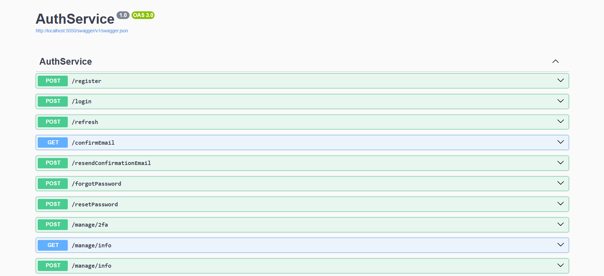
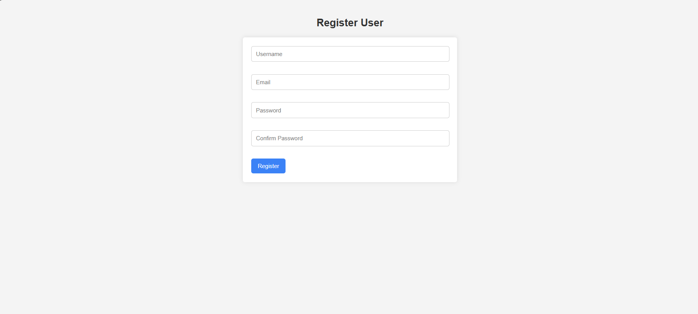
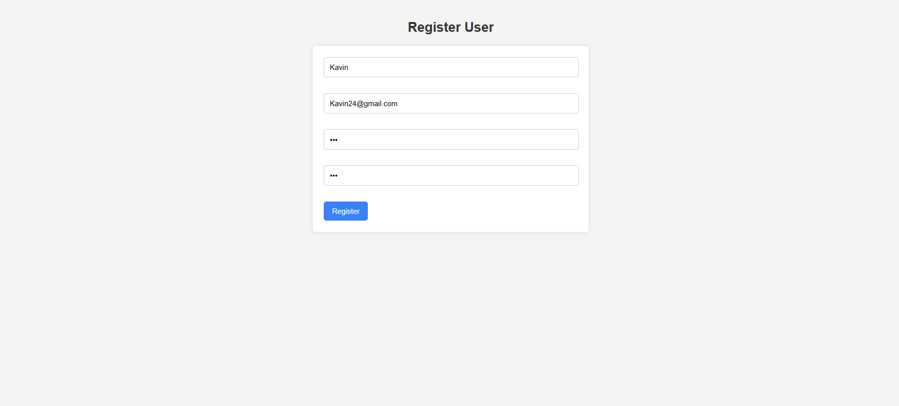
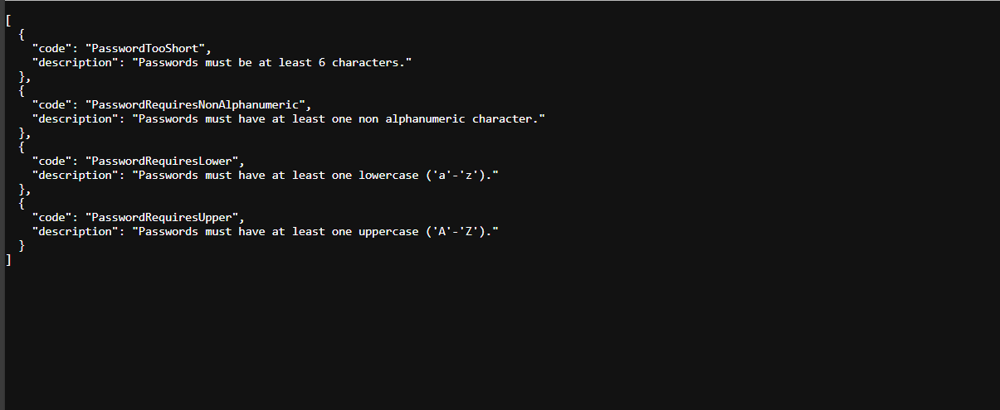
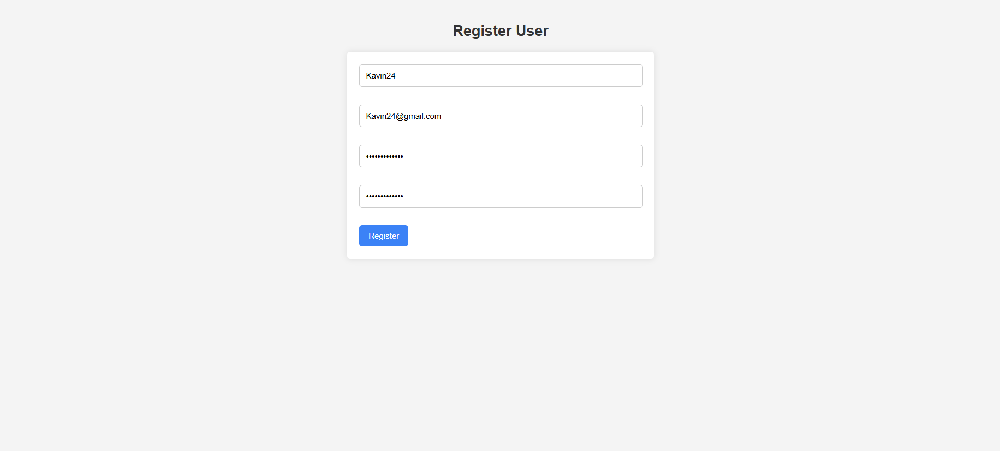
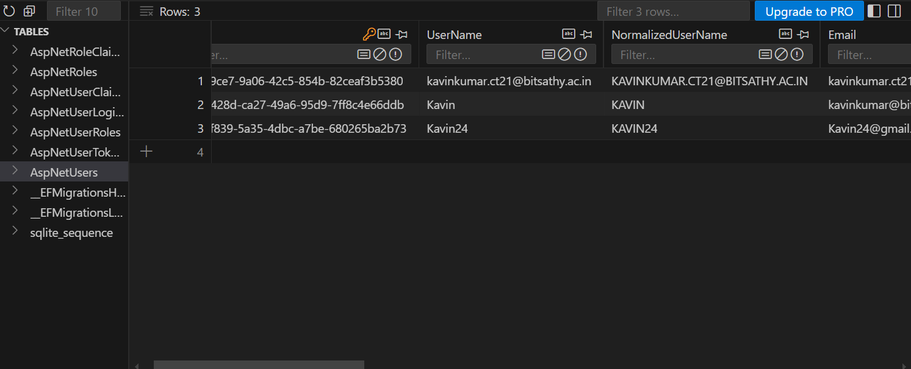

# Created a .NET web API for storing user data in a sqlite database

## Identity Package

- ASP.NET Core Identity is a built-in authentication and user management system in .NET.
- It handles tasks like `user registration`, `login`, `password hashing`, and `role-based authorization` with minimal setup.

### Identity Classes

- `UserManager<TUser>` - Create, find, and manage users (register, update password).

- `SignInManager<TUser>` - Handles user sign-in, logout, and auth checks.

- `IdentityUser` - Built-in user model and also customizable.

- `IdentityRole` - Represents a role like super admin, admin, user.

- `CreateAsync(user, password)` - Registers a new user to configured memory.

### Packages need to Install

```plaintext
  Microsoft.AspNetCore.Identity.EntityFrameworkCore
  Microsoft.EntityFrameworkCore.Sqlite
  Microsoft.AspNetCore.Identity
  Microsoft.EntityFrameworkCore.Design
```

### Db context

- AuthDbContext is a class that connects your application to the database using Entity Framework Core.
- It inherits from `IdentityDbContext<IdentityUser>`, which automatically includes tables for users, roles, and other identity features.

```c#
using Microsoft.AspNetCore.Identity;
using Microsoft.AspNetCore.Identity.EntityFrameworkCore;
using Microsoft.EntityFrameworkCore;

namespace AuthService.Data;

public class AuthDbContext : IdentityDbContext<IdentityUser>
{
    public AuthDbContext(DbContextOptions options) : base(options)
    {

    }

    public new DbSet<IdentityUser> Users { get; set; } = null!;
}
```

### Model

- The RegisterRequest class is a `model` used to represent the data that a user submits when registering an account.

```c#
namespace AuthService.Models
{
    public class RegisterRequest
    {
        public string? UserName { get; set; }
        public string? Email { get; set; }
        public string? Password { get; set; }
        public string? ConfirmPassword { get; set; }
    }
}
```

### Sqlite creation

```plaintext
 dotnet ef migrations add Init
 dotnet ef database update
```

### Controllers

- `[Route("[controller]")]` - while routing controller will be replaced dynamically `/account/`.
- `public AccountController(UserManager<IdentityUser> userManager)` - Used for `Dependency Injection (DI)`, which automatically provides an instance of userManager and it is responsible for managing user-related actions.
- `[HttpPost("register")]` - handles `/account/register` post api.
- `public async Task<IActionResult> Register([FromForm] RegisterRequest model)` - Where it will bind the form data into the model by matching its properties.
- Inside that Register handles the `null` input, matches the password and using `CreateAsync` - object has been created and if any exception occurs then a ActionResult Methods wil be passed accordingly.

```c#
using Microsoft.AspNetCore.Identity;
using Microsoft.AspNetCore.Mvc;
using AuthService.Models;

namespace AuthService.Controllers
{
    [Route("[controller]")]
    public class AccountController : Controller
    {
        private readonly UserManager<IdentityUser> _userManager;

        public AccountController(UserManager<IdentityUser> userManager)
        {
            _userManager = userManager;
        }

        [HttpPost("register")]
        public async Task<IActionResult> Register([FromForm] RegisterRequest model)
        {
            var user = new IdentityUser { UserName = model.UserName, Email = model.Email };
            if (string.IsNullOrWhiteSpace(model.Password))
            {
                return BadRequest("Password cannot be null or empty.");
            }

            if (model.Password != model.ConfirmPassword)
            {
                return BadRequest("Passwords do not match.");
            }
            var result = await _userManager.CreateAsync(user, model.Password);


            if (result.Succeeded)
            {
                return Content("User registered successfully!");
            }

            return BadRequest(result.Errors);
        }
    }
}
```

### Html Page

```plaintext
|- wwwroot - register.html
|- Program.cs
```

- Created a wwwroot folder and keep all the static content related to webpage

### Main Entry

- `AddEndpointsApiExplorer` - Enables  API documentation generation, usually used with Swagger for automatic documentation of your API endpoints.
- `AddSwaggerGen` - Adds a Swagger generator service, which will automatically generates a web API documentation UI.
- `AddDbContext<AuthDbContext>` - Registers the AuthDbContext with the dependency injection container, which allows it to be injected into controllers and services.
- `UseSqlite("Data Source=auth.db")` - Configures the app to use SQLite as the database provider.
- `AddControllers` - Adds support for MVC-style controllers (handle HTTP requests)
- `AddAuthorization` - Enables the app to check user permissions for accessing protected resources.
- `AddIdentityApiEndpoints<IdentityUser>()` - Configuring Identity for authentication and authorization.
- `AddEntityFrameworkStores<AuthDbContext>()` - Identity should use AuthDbContext as the database context for storing identity-related data
- `Build` - Compiles and builds the application.
- `app.Environment.IsDevelopment()` - check if the app is running and then enable the swagger.
- `UseHttpsRedirection` - Redirects HTTP requests to HTTPS, ensuring all communications are secure.
- `UseStaticFiles` - Allows serving static files (e.g., CSS, HTML, JS) from the wwwroot directory.
- `UseAuthorization` - Enables the use of authorization middleware.
- `MapControllers` - Maps the controller actions to the appropriate HTTP routes defined in the controllers.
`Run` - Starts the application and listens for incoming HTTP requests

```c#
using AuthService.Data;
using Microsoft.AspNetCore.Identity;
using Microsoft.EntityFrameworkCore;
using AuthService.Models;


var builder = WebApplication.CreateBuilder(args);

builder.Services.AddEndpointsApiExplorer();
builder.Services.AddSwaggerGen();

builder.Services.AddDbContext<AuthDbContext>(options =>
    options.UseSqlite("Data Source=auth.db"));


builder.Services.AddControllers();

builder.Services.AddAuthorization();

builder.Services.AddIdentityApiEndpoints<IdentityUser>()
    .AddEntityFrameworkStores<AuthDbContext>();

var app = builder.Build();

if (app.Environment.IsDevelopment())
{
    app.UseSwagger();
    app.UseSwaggerUI();
}

app.UseHttpsRedirection();
app.UseStaticFiles();
app.UseAuthorization();
app.MapControllers();
app.MapIdentityApi<IdentityUser>();


app.Run();


```

### Output















